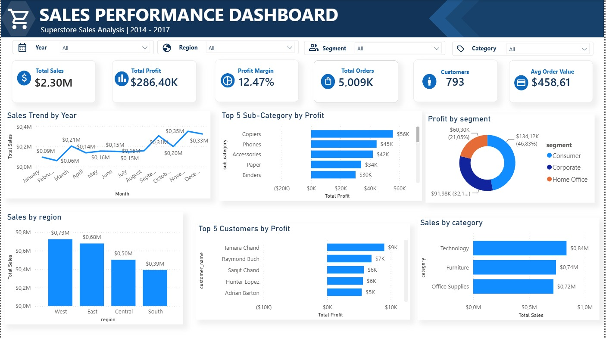

# 📊 Retail Sales Analysis - Superstore Dataset

End-to-end data analysis project menggunakan dataset Sample Superstore, mencakup proses business understanding, data cleaning, exploratory data analysis, SQL analysis, hingga dashboard interaktif menggunakan Power BI.



---

## 📌 Business Background

Superstore merupakan perusahaan retail yang menjual berbagai kategori produk (Furniture, Office Supplies, Technology) kepada pelanggan individu, perusahaan, maupun home office di seluruh wilayah Amerika Serikat. Project ini bertujuan menganalisis performa penjualan dan profit perusahaan untuk menghasilkan rekomendasi bisnis yang actionable.

Detail lengkap business understanding dapat dilihat di [`notebooks/01_business_data_understanding.ipynb`](notebooks/01_business_data_understanding.ipynb).

---

## 🎯 Business Questions

Project ini menjawab 10 business questions mencakup Sales Performance, Product Analysis, Customer Analysis, Regional Analysis, dan Discount Analysis.

Lihat detail lengkap di [`docs/business_questions.md`](docs/business_questions.md).

---

## 🛠️ Tech Stack

- **Python** (pandas, numpy, matplotlib, seaborn) — data cleaning & exploratory data analysis
- **PostgreSQL** — data warehousing & SQL analysis
- **SQLAlchemy & psycopg2** — koneksi Python ke PostgreSQL
- **Power BI** — dashboard interaktif
- **Jupyter Notebook** (Google Colab) — environment analisis

---

## 📂 Project Structure

```
retail-sales-analysis/
├── data/
│   ├── raw/                  # Data mentah
│   └── cleaned/               # Data hasil cleaning
├── notebooks/
│   ├── 01_business_data_understanding.ipynb
│   ├── 02_data_cleaning.ipynb
│   ├── 03_eda.ipynb
│   └── import_cleaned_data.py
├── sql/
│   ├── 01_create_tables.sql
│   ├── 02_import_data.sql
│   └── 03_analysis_queries.sql
├── powerbi/
│   ├── retail_dashboard.pbix
│   └── dashboard_preview.png
└── docs/
    ├── data_dictionary.md
    ├── business_questions.md
    └── recommendations.md
```
---

## 🔍 Workflow

1. **Business & Data Understanding** — memahami konteks bisnis dan struktur data
2. **Data Cleaning** — perbaikan tipe data, penanganan duplikat, dan karakter khusus
3. **Exploratory Data Analysis** — analisis univariate, bivariate, dan multivariate
4. **PostgreSQL** — data warehousing untuk analisis SQL
5. **SQL Analysis** — business queries, KPI analysis, window functions, CTE
6. **Power BI Dashboard** — visualisasi interaktif 3 halaman (Overview, Product & Discount, Customer & Regional)
7. **Business Recommendation** — rekomendasi actionable berdasarkan hasil analisis

---

## 📈 Key Insights

- **Technology** merupakan kategori paling menguntungkan, sementara **Furniture** memiliki Sales tinggi namun profit margin sangat tipis
- Sub-category **Tables dan Bookcases** secara konsisten mengalami kerugian
- Diskon berkorelasi negatif dengan Profit (korelasi -0.219); diskon di atas 50% hampir selalu menghasilkan profit negatif
- Sales menunjukkan pola musiman yang konsisten setiap tahun — penurunan tajam di bulan Januari dan puncak penjualan di kuartal akhir tahun
- Region **West** menjadi wilayah dengan performa terbaik di seluruh Amerika Serikat

Rekomendasi bisnis lengkap dapat dilihat di [`docs/recommendations.md`](docs/recommendations.md).

---

## 📊 Dashboard Preview

Dashboard Power BI terdiri dari 3 halaman:
1. **Overview** — KPI utama, tren penjualan, performa per kategori dan region
2. **Product & Discount Analysis** — profit per sub-category dan pengaruh diskon
3. **Customer & Regional** — top customer, performa segmen, dan wilayah dengan profit terendah

---

## 🚀 How to Run

1. Clone repository ini
2. Install dependencies:

pip install -r requirements.txt

3. Jalankan notebook secara berurutan di folder `notebooks/`
4. Untuk analisis SQL, import data ke PostgreSQL menggunakan `notebooks/import_cleaned_data.py`, lalu jalankan query di `sql/03_analysis_queries.sql`
5. Buka `powerbi/retail_dashboard.pbix` menggunakan Power BI Desktop untuk melihat dashboard interaktif

---

## 👤 Author

**Nadya Dwi Rahmadhani** — Mahasiswa S1 Sistem Informasi, Institut Teknologi Sepuluh Nopember (ITS)